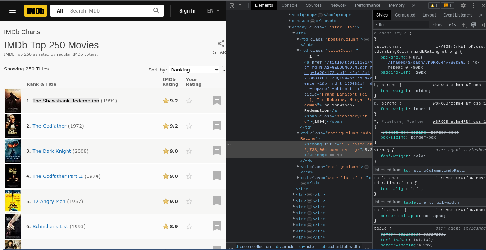

# Webscraper Tool for IMDB Movies and Dummy Job Website
Webscraper is an essential tool to extract information in a website and exporting it in a format that is more readable.

# Requirements
* Beautifulsoup library - parser for HTML extracted code.\
  To install this: 
  ```py
  pip install beautifulsoup4
  ```
* Requests - to make fetch request for the website.
  ```py
  pip install requests
  ```
* Openpyxl - to write scraped data to an excel file.
  ```py
  pip install openpyxl
  ```
# Sites Used
* To test the IMDB Movie Scraper, visit https://www.imdb.com/chart/top/ to see top movies. \
The Scraper filename is __web_scraping.py__
* Test the Dummy Python jobsite scraper with the link https://realpython.github.io/fake-jobs/ \
This is a templated job website, the Scraper filename is __fake.py__

# Using the Tool
* Download all files to test the looping.
* Visit the websites.
* Right-click anywhere and click on __Inspect__. \
__Example: In IMDB__


* Now,you can play around the code and look for each element in the html. Pick
anything that you would like, then add it into the loop.


